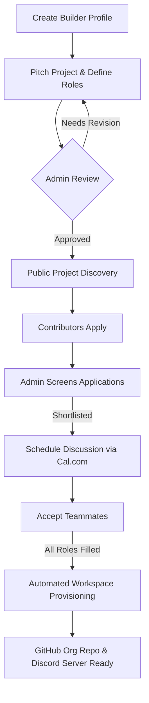

<div align="center">

# Assemble

**Turn ideas into execution-ready teams, automatically.**

[](LICENSE)
[](CONTRIBUTING.md)
[](CODE_OF_CONDUCT.md)
[](#contributors-)
<!-- ALL-CONTRIBUTORS-BADGE:END -->

Assemble is an open-source collaboration platform where builders pitch projects, recruit teammates through structured applications, and instantly receive a ready-to-use collaborative workspace once the team is complete.

[How it works](#how-it-works) · [Tech Stack](#tech-stack) · [Running it locally](#running-it-locally) · [Contributing](#want-to-contribute)

</div>

---

## What is Assemble?

Great ideas fail every day because the right people never find each other.

Assemble bridges the gap between idea pitch and code execution. Instead of spending days searching through scattered Discord servers, LinkedIn feeds, Reddit subreddits, or WhatsApp groups for teammates, project creators can recruit qualified contributors from a single, dedicated platform.

Once a project gets approved by a platform admin, builders apply with their profiles (GitHub, portfolio, resume, and answers to custom questions). Once every required role is filled, Assemble automatically creates a ready-to-use collaborative environment for the team—creating repositories, setting up channels, and inviting members.

---

## Why does it exist?

Finding teammates for hackathons, open-source tools, startup ideas, or side projects is unnecessarily painful:

* **Low visibility:** A message in a "team-formation" channel on Discord gets buried in minutes.
* **No structure:** Creators receive unstructured direct messages with little detail about an applicant's skills or commitment.
* **Manual onboarding friction:** Once a team is agreed upon, someone has to manually set up a GitHub repo, initialize a Discord server, set up role permissions, create channels, and send invitations. This delay kills initial momentum.

Assemble solves this by screening candidates through customizable applications and automating the setup of the team's working environment the moment they are ready to build.

---

## How it works



1. **Pitch a Project:** Detail your project description (in Markdown), category, required roles, difficulty, commitment level, and custom application questions.
2. **Review Applications:** Review portfolios, resumes, and answers in a unified dashboard. Candidates are ranked based on a matching score.
3. **Conduct Discussions:** Shortlist candidates and schedule quick alignment calls directly using the integrated Cal.com scheduler.
4. **Instant Provisioning:** Once the team is complete, the platform automatically provisions:
   - A dedicated **GitHub Repository** under your GitHub Organization.
   - An invite-only **Discord Server** populated with core channels (`#announcements`, `#general`, `#frontend`, `#backend`, `#design`, `#docs`, `#meetings`, `#resources`).

---

## Tech Stack

| Layer | Technologies |
|---|---|
| **Frontend** | Next.js (App Router) · Tailwind CSS · shadcn/ui · Lucide Icons · TypeScript |
| **Backend** | Next.js API Routes (Route Handlers) |
| **Database & Auth** | Supabase (PostgreSQL) · PostgreSQL RLS (Row Level Security) |
| **Integrations & APIs** | GitHub API (Repo creation & invites) · Discord API (Guilds & channels setup) · Cal.com API (Interview scheduling) |
| **Media / Storage** | Cloudinary (Pitch images & profile avatars) |
| **Email** | Resend (Workspace invitations & alerts) |
| **Analytics** | PostHog |
| **Hosting** | Vercel |

---

## Running it locally

### What you need before starting:
- Node.js 20+
- A free [Supabase](https://supabase.com) account
- Git

### Steps:

```bash
# 1. Clone the repository
git clone https://github.com/PRODHOSH/assemble.git
cd assemble

# 2. Install dependencies
npm install

# 3. Create your local environment file
cp .env.example .env.local
```

### Database Setup:
1. Create a free project at [supabase.com](https://supabase.com).
2. Navigate to your project → **SQL Editor** → **New Query**.
3. Copy the contents of the database schema (found in `supabase/schema.sql`) and paste them into the query editor, then click **Run**.
4. Copy your project's URL and anon key from **Project Settings → API** and paste them into your `.env.local` file.

### Startup:
```bash
npm run dev
```
Open `http://localhost:3000` to start building.

For a detailed walkthrough on setting up OAuth, Webhooks, and GitHub/Discord API credentials, check out [CONTRIBUTING.md](CONTRIBUTING.md).

---

## Project Structure

```text
assemble/
├── src/
│   ├── app/              # Next.js App Router (Pages, layout, & Route Handlers)
│   ├── components/       # Custom React components (organized by features)
│   │   ├── ui/           # Base shadcn/ui components (buttons, dialogs, inputs)
│   ├── lib/              # Integration clients & utility functions (GitHub, Discord, Supabase)
│   └── types/            # TypeScript interface & type definitions
├── public/               # Static assets & public images
└── supabase/             # Database migrations & schemas
```

---

## Want to contribute?

Assemble is built by open-source contributors. We welcome pull requests of all sizes, from documentation fixes to core workflow automations.

Before you start:
1. Review the [CONTRIBUTING.md](CONTRIBUTING.md) guide for branch naming, commit standards, and the local setup guide.
2. Read the [CODE_OF_CONDUCT.md](CODE_OF_CONDUCT.md) to understand how we collaborate.
3. Check our [GitHub Issues](https://github.com/PRODHOSH/assemble/issues) to find tasks labeled `good first issue`. Remember to comment on the issue and wait to be assigned before writing code!

---

## Contributors ✨
Everyone who has helped build Assemble — code, design, docs, ideas, all of it.

<!-- ALL-CONTRIBUTORS-LIST:START - Do not remove or modify this section -->
<!-- prettier-ignore-start -->
<!-- markdownlint-disable -->
<table>
  <tbody>
    <tr>
      <td align="center" valign="top" width="14.28%"><a href="https://prodhosh.me"><br /><sub><b>PRODHOSH V.S</b></sub></a><br /><a href="https://github.com/PRODHOSH/assemble/commits?author=PRODHOSH" title="Code">💻</a></td>
    </tr>
  </tbody>
</table>

<!-- markdownlint-restore -->
<!-- prettier-ignore-end -->

<!-- ALL-CONTRIBUTORS-LIST:END -->

---
## Star History

<a href="https://www.star-history.com/?repos=PRODHOSH%2Fassemble&type=date&legend=top-left">
 <picture>
   <source media="(prefers-color-scheme: dark)" srcset="https://api.star-history.com/chart?repos=PRODHOSH/assemble&type=date&theme=dark&legend=top-left" />
   <source media="(prefers-color-scheme: light)" srcset="https://api.star-history.com/chart?repos=PRODHOSH/assemble&type=date&legend=top-left" />
   
 </picture>
</a>

---
## License

This project is licensed under the [MIT License](LICENSE).
